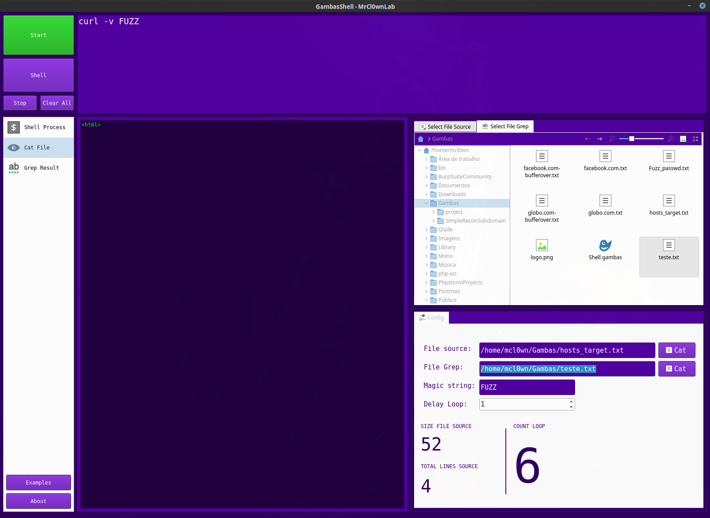

# GambaShell
GambaShell program made to facilitate the processes in the linux terminal


[](http://gambas.sourceforge.net/en/main.html)
[]()

---
```
Autor:    MrCl0wn
Blog:     http://blog.mrcl0wn.com
GitHub:   https://github.com/MrCl0wnLab
Twitter:  https://twitter.com/MrCl0wnLab
Email:    mrcl0wnlab\@\gmail.com
```

## This is a study project ( Interface )
Gambas is a programming language for Linux which attempts to mimic the ease of use of Visual Basic while improving on its functionality. Although Gambas is not source code compatible with Visual Basic, it is a BASIC Interpreter with object-oriented extensions. This makes Gambas a good choice for Linux users who want to use their VB knowledge on a GNU basis.

Gambas makes it very easy to build Linux GUI programs (the Gambas IDE is written in Gambas itself.) using the Qt toolkit. There is a Windows version of Gambas which barely runs under the Cygwin environment. Graphical applications do not yet work under the Windows version.

Developed in Paris by Benoît Minisini since 1999, Gambas is released under the GNU General Public Licence, the current version (July 29, 2009) being 2.15.2 Gambas is included in the Linux Professional Distribution from Novell.

'Gambas' is a backronym for GAMBAS Almost Means BASic (Gambas is also the Spanish word for shrimp.) 

## Installation gambas3
#### Debian
```bash
$ sudo apt-get install gambas3
```
#### Fedora
```bash
$ sudo dnf install gambas3
```
More informations: http://gambaswiki.org/wiki/install

## Executable file
```bash
$ gbr3 GambaShell.gambas
```

## Screenshot:





